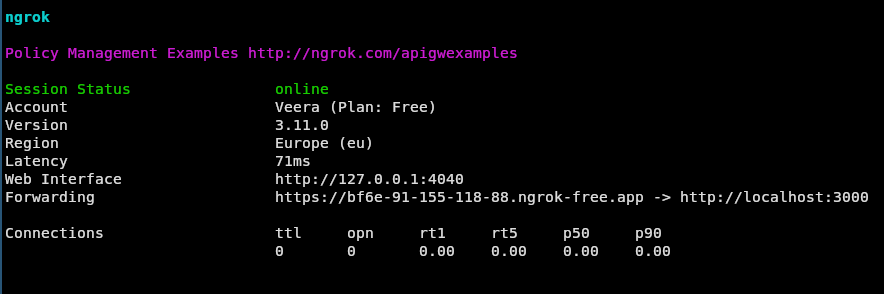
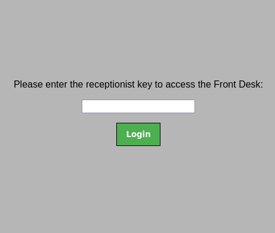
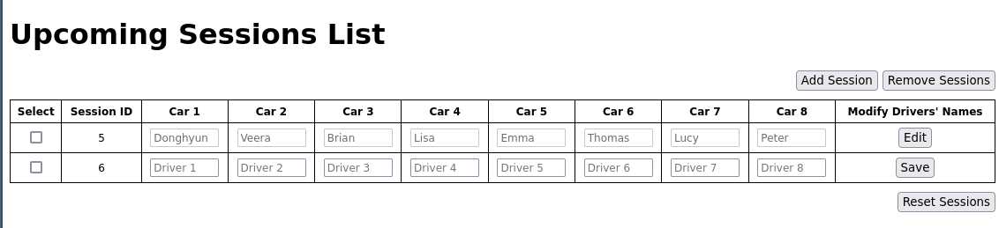
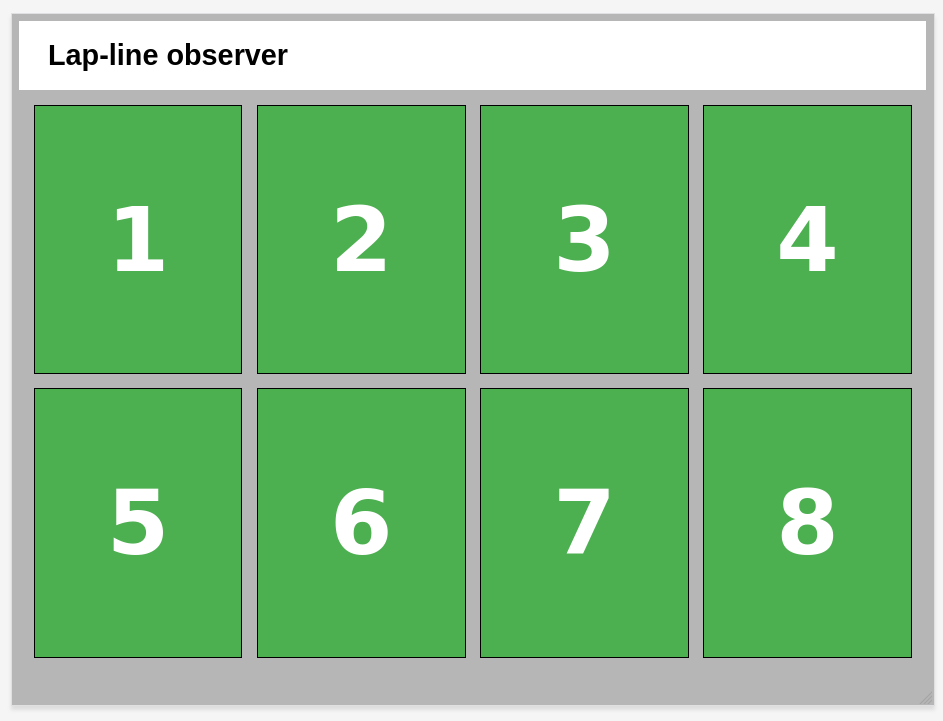
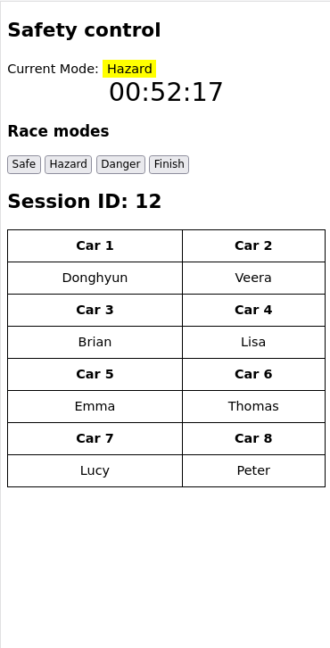
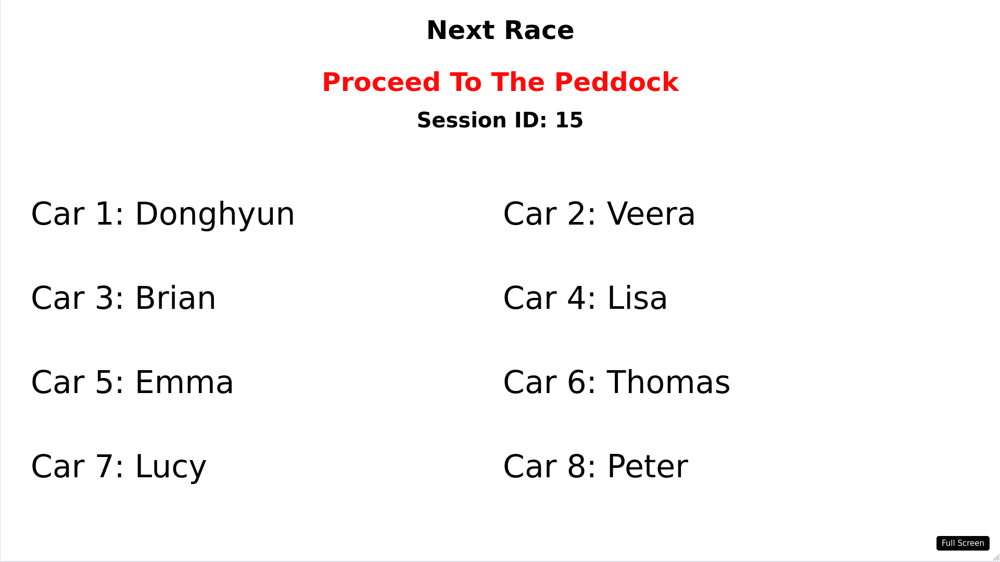
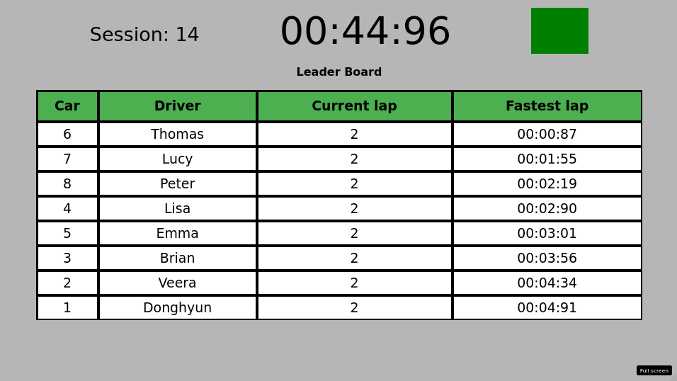
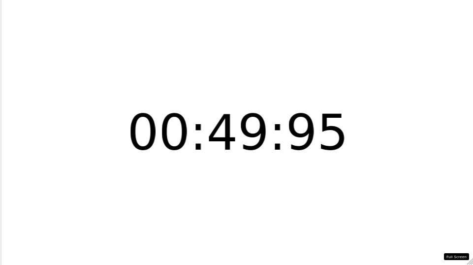

# Racetrack Info-Screens

## Install the software needed

1. npm and Node.js

    To install npm (node package manager) and Node.js, follow the instructions on this web page:

    ```
    https://docs.npmjs.com/downloading-and-installing-node-js-and-npm
    ```
    Node.js version used in this program is: 22.2.0

2. ngrok

    Install nrgok to be able to make the interfaces accessible from other networks. Follow the instructions on this web page:

    ```
    https://ngrok.com/download
    ```

3. node modules

    Needed node modules are installed by running a command `npm install` on the terminal in the working directory.  
    This command will automatically install modules listed in `package.json` -file under `dependencies`.

## Starting the server

### ngrok

Start nrgok in different terminal using the same port as the localhost server (3000) by using following command:

`ngrok http 3000`

Now you should see something like this in your terminal:



The route to use for the web interfaces can be seen in the `Forwarding` -row.

In the example case it is: `https://bf6e-91-155-118-88.ngrok-free.app`

### Set the environmental variables

Employee interfaces require a key to access them.  
These keys must be set before starting the server.  
Keys are set by running following commands on terminal:

```
export receptionist_key=<key_here>  
export observer_key=<key_here>  
export safety_key=<key_here> 
```

Replace `<key_here>` with the key values of your choosing. 

### Start the localhost server

Server can be started in developer mode or default mode.
 
- **Developer mode:** Race timer lasts for 1 minute  
command: `npm run dev`  
- **Default mode:** Race timer lasts for 10 minutes  
command: `npm start`.

Server can be shut down by pressing `ctrl` + `C`.

## Interface usage

Access the interfaces by using the route from ngrok.
For example to access front desk in our example case this should be written to browser's address bar:

 ```
 https://bf6e-91-155-118-88.ngrok-free.app/front-desk
 ```

### Employee interfaces

Employee interfaces  
`/front-desk`,  
`/lap-line-tracker` and  
`/race-control`  
need the key to be accessible.

Use the values assigned to  
`receptionist_key`,  
`observer_key` and  
`safety_key`  
as keys respectively.

For example the front desk login looks like this:



#### Front desk

Route: `/front-desk`

Front desk -interface is designed to be used on a desktop screen by the receptionist.

Receptionist is able to:

- Add sessions by pressing `Add Session` -button
- Assign drivers to cars by writing their names to the column of a selected car and then pressing `Save`
- Edit drivers (remove, add or change the names) in sessions by pressing `Edit` and after changes pressing `Save`
- Remove sessions by selecting sessions to remove using checkboxes in the leftmost column and then pressing `Remove Sessions` 

As a bonus receptionist can reset sessions so that previous sessions are saved into a database file in `database/backup` directory and session count starts from 1 again. This feature is only availabe between race sessions.



#### Lap line tracker

Route: `/lap-line-tracker`

Lap line tracker -interface is designed to be used on a tablet device by the lap line observer. It works both in landscape and portrait orientation.

When the race starts, buttons for each car in the current race appear to the lap line tracker -interface. The lap line observer presses the button when a car crosses the lap line to add one to the car's lap count and update it's fastest lap time.



#### Race control

Route: `/race-control`

Race control interface is designed to be used on a small mobile device like a smart phone by the safety official.

Safety official controls the race by starting the race session, controlling current race mode and ending the race session.

Current race drivers are displayed under the race control buttons.

Example of the safety interface when race is on:




### Public interfaces

Public interfaces are displayed in 40-75 inch monitors and do not require a key to access them. Every public interface has a `full srceen` -button on the bottom right corner.


#### Next race

Route: `/next-race`

Next race public interface shows next race's drivers and the cars they are assigned to. When the previous session ends and it is safe for the drivers to move to the cars, "Proceed to the peddoc" message flashes on the screen.

Example of the next race interface:



#### Race Flag

Route: `/race-flags`

Race flags interface shows the current race mode:

- safe: green screen
- hazard: yellow screen
- danger: red screen
- finish: checkered screen

Example of the race flags interface when race mode is 'finish':


#### Leader board

Route: `/leader-board`

Leader board -interface shows current race mode (as a flag) and race timer.  
It also displays current session's drivers, their fastest lap times and current laps.  
Leader board updates as cars cross the lap line. The driver info on the leader board is ordered by the fastest lap time.

Example of the leader board -interface:



#### Race countdown

Route: `/race-countdown`

Race countdown interface shows the timer for the current race.

Example of the race countdown:



## Data persistence

Race session data is stored in the database so that the server can be shut down and restarted without losing the race session data.


